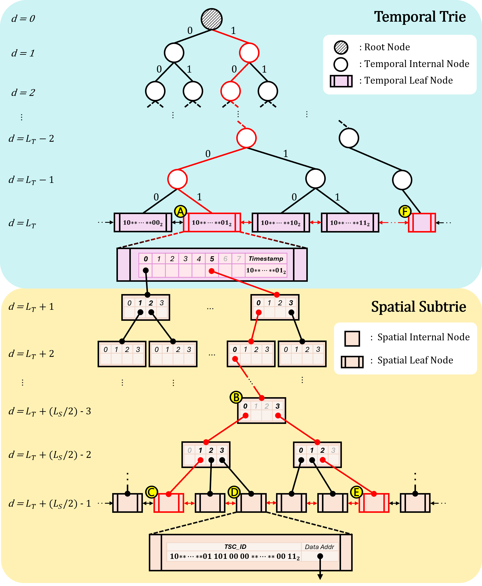

# A Memory-Efficient Trie Index Structure for Fast Retrieving Spatiotemporal IoT Data

> **Abstract:** Efficient spatiotemporal IoT data indexing is crucial for real-time analytics and query processing. However, conventional tree-based spatiotemporal indexes struggle to balance update efficiency and query performance, especially under high-frequency data streams. Frequent insertions and deletions cause excessive node splits and rebalancing, increasing computational overhead. The cache-unfriendly nature of existing indexing structures also results in frequent cache misses, leading to excessive memory access and degraded query performance. To address these challenges, we propose TST, a novel spatiotemporal index leveraging temporal prefixes. TST introduces: (1) an encoding scheme that preserves 3D spatiotemporal locality while compressing it into a 1D representation, (2) constant-time data insertion and deletion using bitwise operations, and (3) a cache-friendly design with memory-aligned structure for efficient access. Extensive experiments on three real-world datasets demonstrate that TST reduces reorganization overhead by up to 200×, accelerates index construction by 1011×, and improves cache hit rate by 2.7×, resulting in up to 98% faster query response times compared to existing methods.

TST is a trie-based indexing structure designed for fast index reconstruction and efficient spatiotemporal data retrieval through a cache-friendly design. As shown in Figure 1, the indexing scheme consists of two parts: a temporal trie and a spatial subtrie. The temporal trie, which is structured as a binary trie, is constructed using fixed-length time bit values determined by the time resolution. At the boundary of the temporal trie, timestamps are mapped to discrete bins, which serve as entry points for the spatial subtrie. Using S2Geometry, the spatial subtrie is constructed by extracting the ID of the S2 cell that contains the spatial coordinates at level _k_.

<p align="center">
  
  <br>
  <b>Figure 1</b>: Overall structure of TST: "<i>d</i>" indicates the depth of TST, and the route colored in red exemplifies a search path via the array index.
</p>

## 📦 Dataset Preparation

TST can be used with any dataset that includes timestamps and spatial coordinates. Two real-world datasets (**T-Drive** and **DSSN**) cab be obtained from `./DATASET` in our repository. Since the original datasets are quite large, we provide sampled versions for testing TST.

**Note:** The **Earthquake** dataset is not included, as it requires permission from NIED (National Research Institute for Earth Science and Disaster Resilience). We recommend downloading the original datasets from the links below and preprocessing them for use:

https://www.microsoft.com/en-us/research/publication/t-drive-trajectory-data-sample/

https://github.com/deshanadesai/Geospat

https://www.kyoshin.bosai.go.jp/

## 🔧 Running the Code

[**S2Geometry**](https://github.com/google/s2geometry) must be installed before using TST. Including `TST.hpp` enables data encoding, node insertion, and data searching.

### Insertion

```c++
#include "TST.hpp"
typedef int ValueType;

// set (1) spatial resolution: S2 Cell Level
//     (2) temporal resolution: "year", "month", "day", "hour", "minute" and "second"
TST::TST<ValueType> tst(20, "hour");
ValueType val = 10;

unsigned long long encoded_temp = tst.time_encoder(2008, 2, 2, 15);
unsigned long long encoded_spat = tst.space_encoder(39.921, 116.511);

tst.Insert(encoded_temp, encoded_spat, val);
```

### Deletion

```c++

ValueType val = 10;

unsigned long long encoded_temp = tst.time_encoder(2008, 2, 2, 15);
unsigned long long encoded_spat = tst.space_encoder(39.921, 116.511);

// No operation is performed if no matching node or data exists.
tst.Delete(encoded_temp, encoded_spat, val);
```

### Search

```c++
vector<ValueType> result;

// Perform a spatiotemporal range query from 14:00 to 16:00 on February 2, 2008,
// within the rectangular spatial region defined by (39.913, 116.321) and (39.922, 116.625).
unsigned long long timeWindow_start = tst.time_encoder(2008, 2, 2, 14);
unsigned long long timeWindow_end = tst.time_encoder(2008, 2, 2, 16);
vector<double> spatialWindow_leftBottom = {39.913, 116.321};
vector<double> spatialWindow_rightUpper = {39.922, 116.625};

// Identify the set of S2 cells within the spatial window.
auto s2Cells = tst.REC_S2_FINDER(spatialWindow_leftBottom, spatialWindow_rightUpper);

tst.range_search(s2Cells, timeWindow_start, timeWindow_end, result);
int nhits = result.size();
```

## ✔️ Testing

Index construction and range queries can be performed in the `CODE` folder. The `-ls2` flag tells the GCC compiler to link against the S2Geometry.

#### T-Drive

```bash
$ g++ -std=c++17 -Wall TDrive.cpp -o tdrive -ls2
```

#### DSSN

```bash
$ g++ -std=c++17 -Wall DSSN.cpp -o dssn -ls2
```

## 💡 Acknowledgement

We appreciate the following github repos a lot for their valuable code base:

https://github.com/Kronuz/cpp-btree

https://github.com/Trinity-data-store/Trinity
